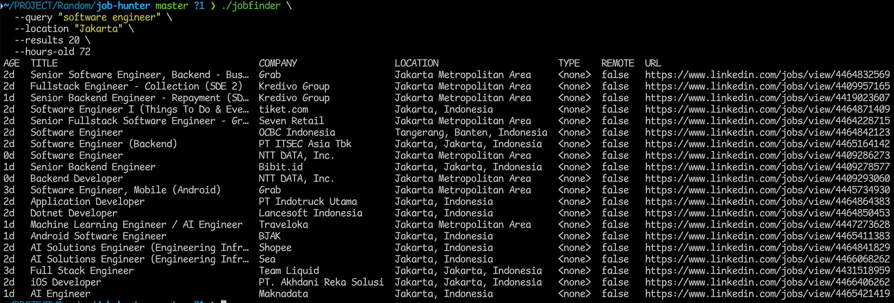
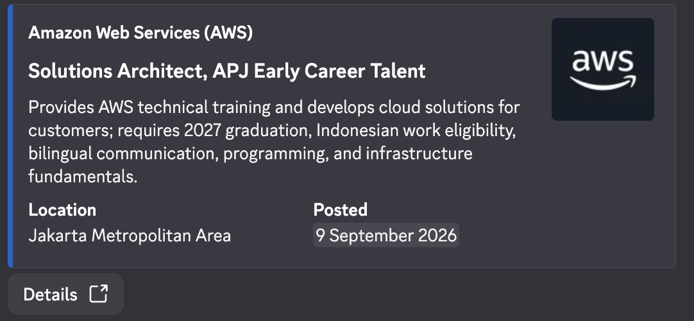

# job-hunter

[](https://pkg.go.dev/github.com/akmalfairuz/job-hunter)
[](https://github.com/AkmalFairuz/job-hunter/actions/workflows/compile.yml)

`job-hunter` is a Go toolkit for finding jobs from LinkedIn's public listings.
It includes:

- `finder`: a reusable Go library.
- `jobfinder`: a command-line search tool.
- `jobbot`: a Discord bot for scheduled, AI-filtered notifications.

The project only implements LinkedIn search and does not require a LinkedIn
account.

## Requirements

- Go 1.25 or later.
- MySQL when running the Discord bot.
- A Discord application and an OpenAI-compatible API for bot integrations.

## Command-line tool

Build `jobfinder`:

```sh
go build -o jobfinder ./cmd/jobfinder
```

Search one or more locations:

```sh
./jobfinder \
  --query "software engineer" \
  --location "City A" \
  --location "Region B" \
  --results 20 \
  --hours-old 24
```



Table output is used by default. Other supported formats are `wide` and
`json`:

```sh
./jobfinder --query "software engineer" --location "City A" -o wide
./jobfinder --query "software engineer" --location "City A" -o json
```

Use `--output-file` to save the result and `--fetch-description` to retrieve
job descriptions and other detail-page fields. Fetching descriptions requires
an additional request for each unique job.

Run `./jobfinder --help` for all available search and output options.

## Go library

```go
package main

import (
    "context"

    "github.com/akmalfairuz/job-hunter/finder"
)

func main() {
    client := finder.NewClient(finder.ClientConfig{})
    jobs, err := client.Search(context.Background(), finder.SearchOptions{
        Query:         "software engineer",
        Locations:     []string{"City A", "Region B"},
        ResultsWanted: 20,
        HoursOld:      24,
    })
    _ = jobs
    _ = err
}
```

Multiple locations are searched round-robin. Results are deduplicated by
LinkedIn job ID, and `ResultsWanted` applies to the combined result.

Set `FetchDescription` when descriptions and detail-page metadata are needed.
The library can return partial results together with an error if only part of a
search succeeds.

## Discord bot

`jobbot` stores named searches, runs them on a schedule, filters results with
an OpenAI-compatible API, and sends matching jobs to Discord.



### Setup

1. Create a MySQL database and apply the schema:

   ```sh
   mysql -u root -p jobbot < migrations/001_jobbot.sql
   ```

2. Copy `.env.example` to `.env` and configure the Discord, MySQL, LLM,
   scheduler, and LinkedIn settings. Process environment variables take
   precedence over `.env` values.

3. Build and start the bot:

   ```sh
   go build -o jobbot ./cmd/jobbot
   ./jobbot
   ```

### Docker

Tagged releases publish `jobbot` to GitHub Container Registry. After creating
your `.env`, start the latest image and its MySQL database with:

```sh
docker compose up -d
```

The MySQL schema is initialized from `migrations/001_jobbot.sql` when its
Docker volume is first created. Configure the connection with the individual
`MYSQL_HOST`, `MYSQL_PORT`, `MYSQL_DATABASE`, `MYSQL_USER`, and
`MYSQL_PASSWORD` variables. The Compose-oriented `.env.example` uses the
`mysql` service hostname; use `127.0.0.1` instead when running `jobbot`
outside Docker.

Invite the Discord application with the `bot` and `applications.commands`
scopes. Notification channels must allow View Channel, Send Messages, Embed
Links, and Use Application Commands.

`DISCORD_ALLOWED_GUILD_IDS` controls which servers can use the bot. All `/jobs`
subcommands require Manage Server permission.

### Commands

| Command | Purpose |
| --- | --- |
| `/jobs add` | Create a named search and notification target. |
| `/jobs update` | Change a saved search. |
| `/jobs remove` | Delete a saved search. |
| `/jobs list` | List saved searches, optionally by channel. |
| `/jobs enable` | Enable scheduled runs for a search. |
| `/jobs disable` | Disable scheduled runs for a search. |
| `/jobs run` | Run a saved search immediately. |

Locations are supplied as a comma-separated list. `ai_prompt` adds custom
filtering criteria. A manual run can set `hours_old`; otherwise it uses the
scheduler's configured job age.

### Notification behavior

- Several searches may target the same channel without duplicating a job.
- A job is sent once per channel and LinkedIn posted date.
- A later posted date is treated as a repost and displays `Reposted`.
- AI overviews are limited to one short sentence about responsibilities and
  requirements.
- The **Details** button opens the LinkedIn job URL directly.
- LLM decisions are cached persistently in MySQL. Unchanged content reuses the
  cached result across duplicate searches and repost dates.

## Notes

LinkedIn's public page structure and request behavior may change. Searches can
also be rate-limited or return partial results. Use appropriate request rates
and review LinkedIn's applicable terms before operating the tools.
